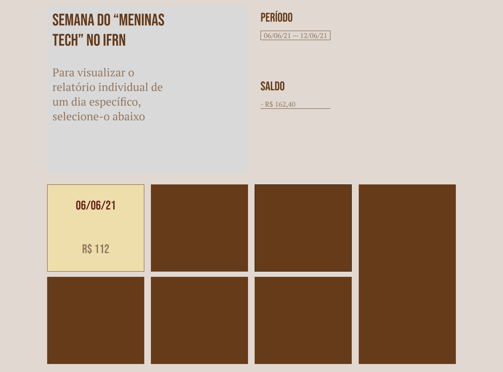
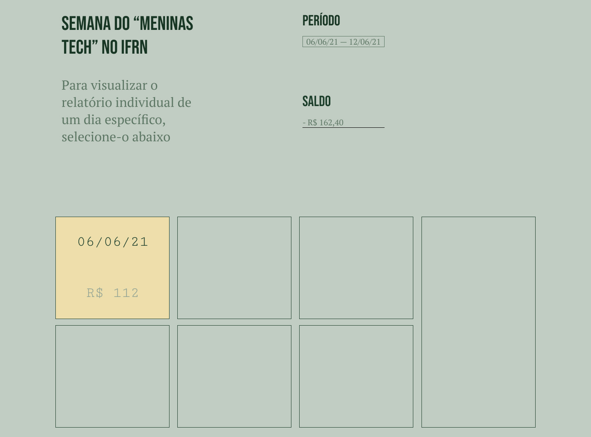
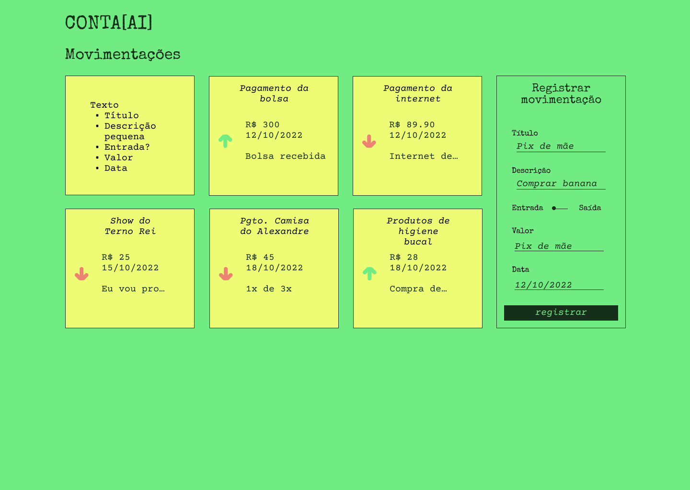
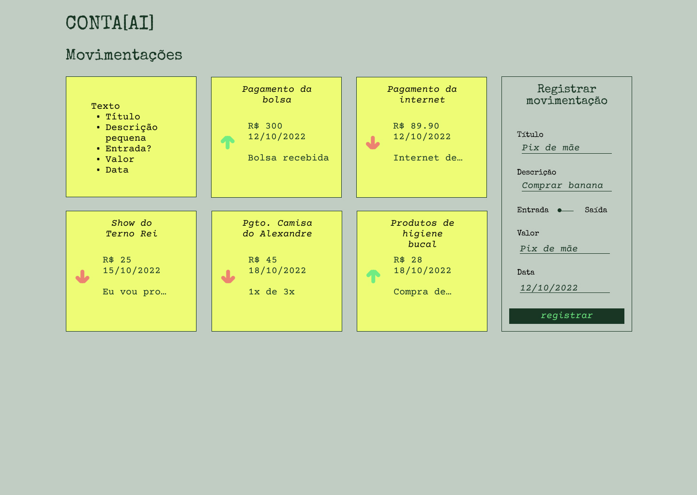
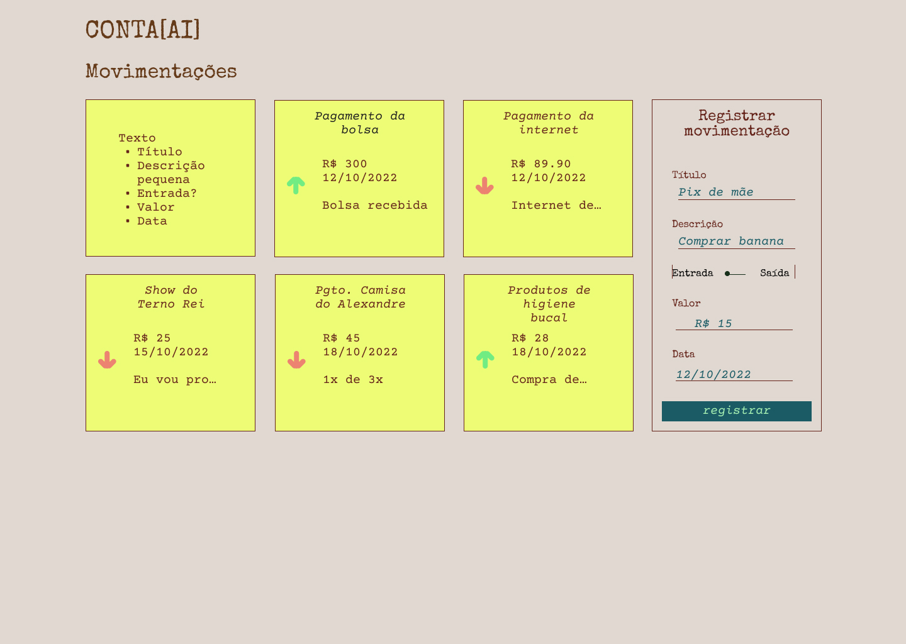

# conta-ai-frontend
Frontend do projeto CONTA[AI]

## Atualmente
Atualmente o projeto está com uma instância Vue quase limpa.

## Assets
Para tentar agilizar o processo de desenvolvimento, há uma série de scripts na pasta [assets/scripts/](assets/scripts/) que automatizam algumas tarefas comuns ao ambiente de desenvolvimento.

## Protótipos de interface

